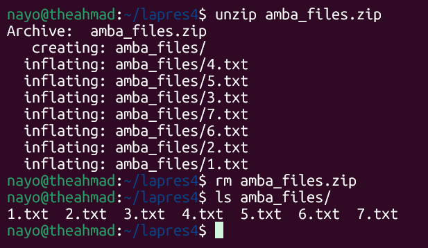
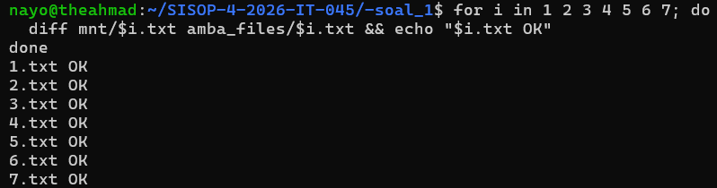
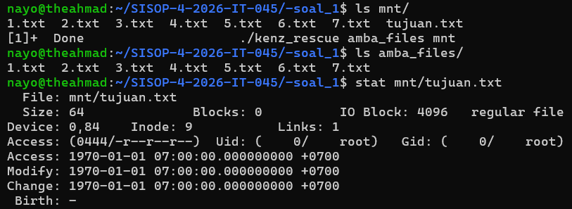
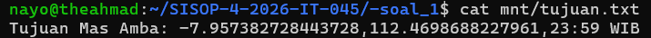
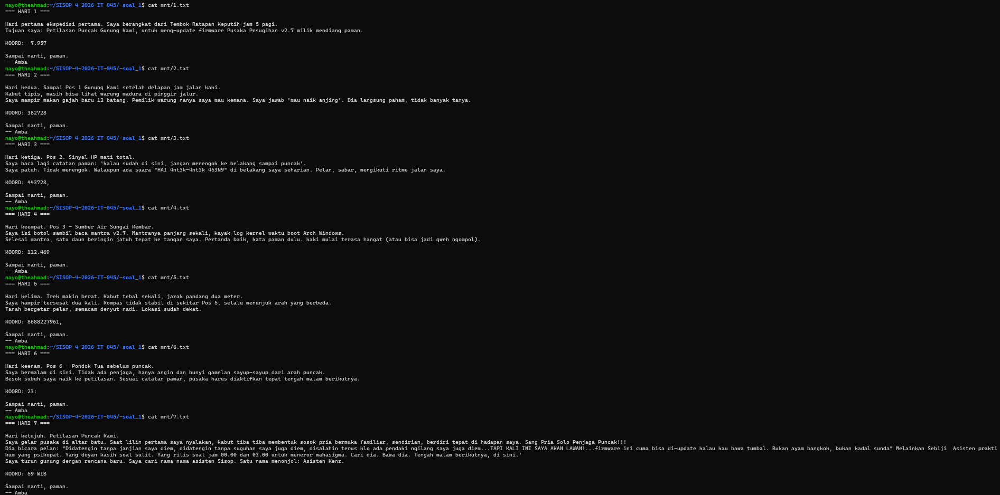

# SISOP-4-2026-IT-045
#### 5027251045 - Ahmad Nayottama Juliansyah - Sistem Operasi (B)


### Soal 1: Save Asisten Kenz
---
#### Deskripsi Soal
Pada praktikum ini, praktikan diminta membuat filesystem virtual sederhana menggunakan FUSE (Filesystem in Userspace) dalam bahasa C. Filesystem yang dibuat bernama kenz_rescue.c dan berfungsi sebagai passthrough filesystem, yaitu meneruskan operasi dasar seperti getattr, readdir, open, dan read ke source directory yang berisi tujuh file teks 1.txt hingga 7.txt. Seluruh file pada mount directory harus memiliki isi yang identik dengan file sumber tanpa mengubah data asli.

Selain itu, disini juga diminta untuk menambahkan file virtual bernama tujuan.txt pada mount directory. File ini tidak benar-benar tersimpan di source directory, tetapi dibuat secara dinamis ketika diakses. Isi file diperoleh dengan menggabungkan fragmen koordinat berawalan KOORD: dari ketujuh file teks sesuai urutan nama file. Praktikum ini bertujuan melatih pemahaman mengenai filesystem virtual, mekanisme passthrough FUSE, serta pembuatan file virtual dengan konten yang dihasilkan secara on-the-fly.

---
#### Langkah Penyelesaian
1. Mengambil Arsip Amba Files

Langkah pertama dilakukan dengan mengambil arsip Amba Files dari flashdisk peninggalan Asisten Kenz. Arsip kemudian di-unzip hingga menghasilkan folder amba_files/ yang berisi tujuh catatan log ekspedisi bernama 1.txt sampai 7.txt. Setelah proses ekstraksi selesai, file zip dihapus agar tidak meninggalkan jejak perubahan pada isi flashdisk.




2. Membuat Filesystem kenz_rescue

Selanjutnya dibuat program FUSE bernama kenz_rescue.c yang menerima parameter source directory dan mount directory. Filesystem ini berfungsi sebagai filesystem cermin (passthrough), sehingga ketujuh file log ekspedisi pada mount directory memiliki isi yang identik dengan file asli di amba_files/. Callback dasar seperti getattr, readdir, open, dan read digunakan untuk meneruskan akses langsung ke file sumber.



3. Menambahkan File Virtual tujuan.txt

Setelah filesystem passthrough berhasil dijalankan, ditambahkan sebuah file virtual bernama tujuan.txt pada root mount directory. File ini dibuat agar muncul pada hasil ls mnt/, namun tidak benar-benar tersimpan di dalam amba_files/ agar Mas Amba tidak curiga bahwa flashdisknya pernah diakses.



4. Menemukan Koordinat Ritual

Tahap terakhir dilakukan dengan membangkitkan isi tujuan.txt secara on-the-fly. Program membaca setiap catatan ekspedisi dari 1.txt hingga 7.txt, mengambil fragmen koordinat yang diawali dengan prefiks KOORD:, lalu menggabungkannya sesuai urutan file. Hasil akhirnya ditampilkan dalam format Tujuan Mas Amba: <gabungan_fragmen> sebagai petunjuk lokasi ritual untuk menyelamatkan Asisten Kenz sebelum prosesi tumbal dilakukan.




---
#### Penjelasan Code


``` 
static void build_source_path(char *buf, const char *fuse_path)
{
    snprintf(buf, PATH_MAX, "%s%s", source_path, fuse_path);
}
```

```
for (int i = 1; i <= 7; i++) {
    // disini membuka amba_files/ dari 1.txt hingga 7.txt
    FILE *f = fopen(filepath, "r");

    while (fgets(line, sizeof(line), f)) {
        char *koord = strstr(line, "KOORD:");  // cari baris ber-prefix KOORD:
        if (koord) {
            char *fragment = koord + strlen("KOORD:"); // mengambil teks setelah KOORD:
            strncat(combined, fragment, ...);  // menggabungkan semua.
        }
    }
}
sprintf(result, "Tujuan Mas Amba: %s\n", combined);
}

```

```
static int kr_getattr(const char *path, struct stat *stbuf)
{
    memset(stbuf, 0, sizeof(struct stat));

    if (strcmp(path, VIRTUAL_FILE) == 0) {
        char *content = build_tujuan_content();
        size_t sz = content ? strlen(content) : 0;
        free(content);

        stbuf->st_mode  = S_IFREG | 0444;
        stbuf->st_nlink = 1;
        stbuf->st_size  = (off_t)sz;

        return 0;
    }

    char real[PATH_MAX];
    build_source_path(real, path);

    int res = lstat(real, stbuf);
    if (res == -1) return -errno;
    return 0;
}
```

```
static int kr_readdir(const char *path, void *buf, fuse_fill_dir_t filler,
                      off_t offset, struct fuse_file_info *fi)
{
    (void) offset;
    (void) fi;

    char real[PATH_MAX];
    build_source_path(real, path);

    DIR *dp = opendir(real);
    if (!dp) return -errno;

    filler(buf, ".",  NULL, 0);
    filler(buf, "..", NULL, 0);

    struct dirent *de;
    while ((de = readdir(dp)) != NULL) {
        if (strcmp(de->d_name, ".") == 0 || strcmp(de->d_name, "..") == 0)
            continue;
        filler(buf, de->d_name, NULL, 0);
    }
    closedir(dp);

    if (strcmp(path, "/") == 0) {
        filler(buf, "tujuan.txt", NULL, 0);
    }

    return 0;
}
```

```
static int kr_open(const char *path, struct fuse_file_info *fi)
{
    if (strcmp(path, VIRTUAL_FILE) == 0) {
        if ((fi->flags & O_ACCMODE) != O_RDONLY)
            return -EACCES;
        return 0;
    }

    char real[PATH_MAX];
    build_source_path(real, path);

    int fd = open(real, fi->flags);
    if (fd == -1) return -errno;

    fi->fh = (uint64_t)fd;
    return 0;
}
```

```
static int kr_read(const char *path, char *buf, size_t size, off_t offset,
                   struct fuse_file_info *fi)
{
    if (strcmp(path, VIRTUAL_FILE) == 0) {
        char *content = build_tujuan_content();
        if (!content) return -ENOMEM;

        size_t len = strlen(content);
        int res = 0;

        if ((size_t)offset < len) {
            size_t available = len - (size_t)offset;
            size_t to_copy   = size < available ? size : available;
            memcpy(buf, content + offset, to_copy);
            res = (int)to_copy;
        }
        free(content);
        return res;
    }

    int fd = (int)fi->fh;
    int res = (int)pread(fd, buf, size, offset);
    if (res == -1) return -errno;
    return res;
}
```

```
int main(int argc, char *argv[])
{
    if (argc < 3) {
        fprintf(stderr,
            "Usage: %s <source_directory> <mount_directory> [fuse_options]\n",
            argv[0]);
        return 1;
    }

    if (realpath(argv[1], source_path) == NULL) {
        perror("realpath source_directory");
        return 1;
    }

    int new_argc = argc - 1;
    char **new_argv = malloc((size_t)(new_argc + 1) * sizeof(char *));
    if (!new_argv) { perror("malloc"); return 1; }

    new_argv[0] = argv[0];
    for (int i = 1; i < new_argc; i++)
        new_argv[i] = argv[i + 1];
    new_argv[new_argc] = NULL;

    return fuse_main(new_argc, new_argv, &kr_ops, NULL);
}
```


---
#### Output




---
#### Kendala
tidak ada kendala.


